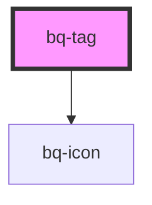

# bq-tag

<!-- Auto Generated Below -->

## Properties

| Property    | Attribute   | Description                                                   | Type                             | Default     |
| ----------- | ----------- | ------------------------------------------------------------- | -------------------------------- | ----------- |
| `disabled`  | `disabled`  | If true, the button will be disabled (no interaction allowed) | `boolean`                        | `false`     |
| `href`      | `href`      |                                                               | `string`                         | `undefined` |
| `removable` | `removable` | If `true` it will display the tag with a remove icon          | `boolean`                        | `true`      |
| `size`      | `size`      | The size of the tag                                           | `"large" \| "medium" \| "small"` | `'medium'`  |

## Shadow Parts

| Part       | Description |
| ---------- | ----------- |
| `"label"`  |             |
| `"prefix"` |             |

## Dependencies

### Depends on

- [bq-icon](../icon)

### Graph

----------------------------------------------

*Built with [StencilJS](https://stenciljs.com/)*
